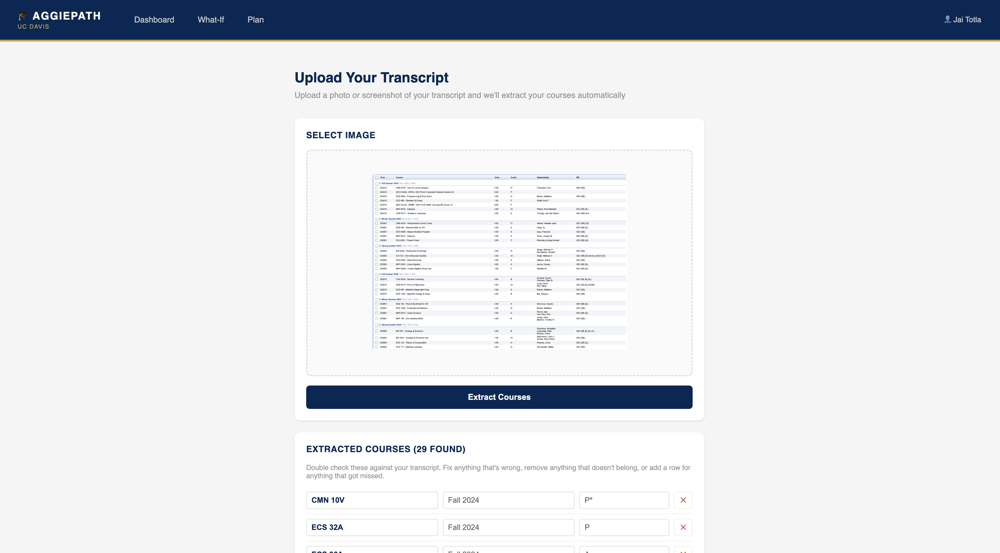
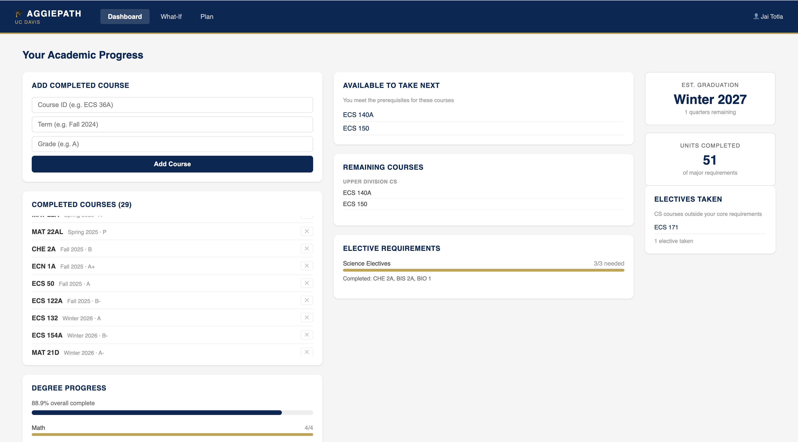
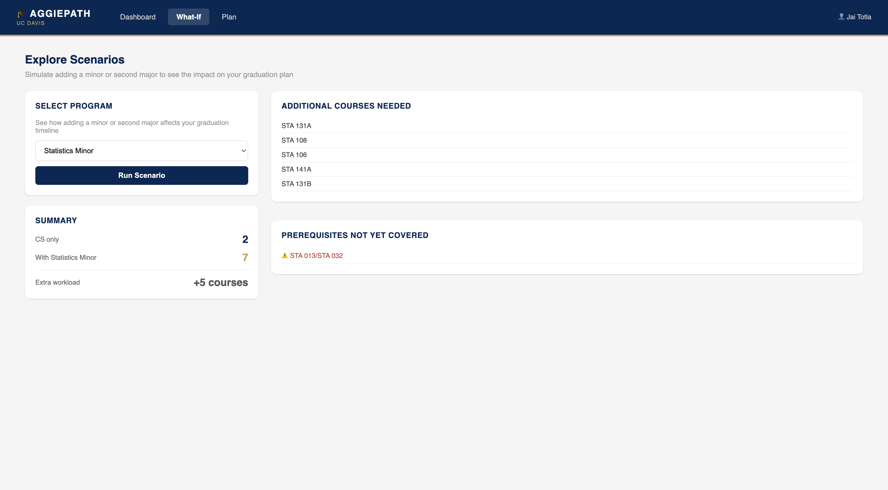
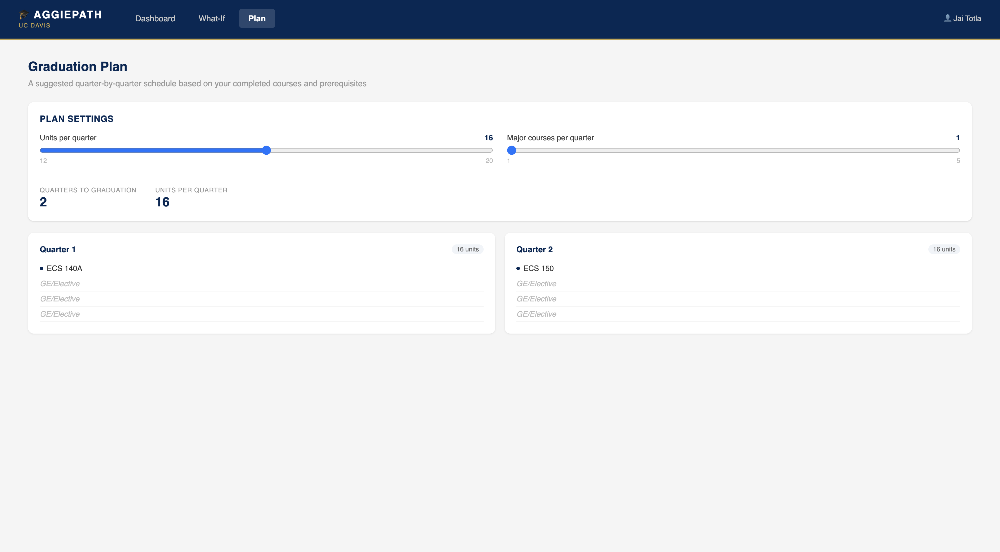

# AggiePath 🎓

A full-stack graduation planning web application for UC Davis Computer Science students.

**Live:** https://aggie-path.vercel.app

---

## What it does

AggiePath lets UC Davis CS students track their degree progress, generate a quarter-by-quarter graduation plan, and simulate adding a minor, all in one place, without waiting for an advising appointment.

---

## Features

**Dashboard:**
Track completed courses with a scrollable history, view degree progress broken down by category (Math, Lower Division CS, Upper Division CS, Science Electives), see which courses you are eligible to take next based on your completed prerequisites, and track CS electives taken outside your core requirements.

**AI Transcript Import:**
Upload a photo or screenshot of your UC Davis OASIS transcript. Claude Vision reads the image, extracts all completed courses with terms and grades, normalizes course IDs, and populates your dashboard automatically.

**Graduation Plan:**
Generates a quarter-by-quarter course schedule using a priority-based scheduling algorithm. Adjustable sliders for units per quarter and major courses per quarter. Remaining slots filled with GE/Elective placeholders.

**What-If Scenarios:**
Select a minor (Statistics) to see how it affects your graduation timeline. Shows courses remaining with CS only vs combined, extra workload, overlapping courses that count toward both programs, and uncovered prerequisites.

**Prerequisite Engine:**
Determines which courses you can take next by checking that all prerequisites are satisfied. Handles OR-style prerequisites (e.g. STA 013 or STA 032) natively.

---

## Tech Stack

**Frontend:** React 18, Vite, React Router v6

**Backend:** Python 3.12, FastAPI, SQLModel

**Database:** SQLite (local), PostgreSQL (production)

**AI:** Anthropic Claude API (claude-sonnet-4-5, vision model)

**Deployment:** Vercel (frontend), Render (backend + database)

---

## Data

Real UC Davis 2025-2026 catalog data:
- 15 core CS major requirements across 4 categories
- Science elective group: pick any 3 from PHY/CHE/BIS/BIO series (12 options)
- Statistics minor (5 courses)
- 29 prerequisite relationships
- Priority-based plan generator using recursive topological scoring

---

## Project Structure

```
aggiepath/
├── backend/
│   ├── main.py           # FastAPI routes, business logic, algorithms
│   ├── models.py         # SQLModel database models
│   ├── database.py       # Connection and session management
│   └── requirements.txt
│
└── frontend/
    └── src/
        ├── pages/        # Dashboard, Plan, WhatIf, Login, Onboarding, Upload
        └── components/   # Reusable UI components
```

---

## Running Locally

**Backend**
```bash
cd backend
python3 -m venv venv
source venv/bin/activate
pip install -r requirements.txt
export ANTHROPIC_API_KEY="your-key-here"
python -m uvicorn main:app --reload
```

**Frontend**
```bash
cd frontend
npm install
npm run dev
```

Visit `http://localhost:5173`

**Seed the database**

With the backend running, hit `POST /seed` at `http://127.0.0.1:8000/docs`

---

## Screenshots









---

## Author

Jai Totla  
UC Davis Computer Science & Statistics